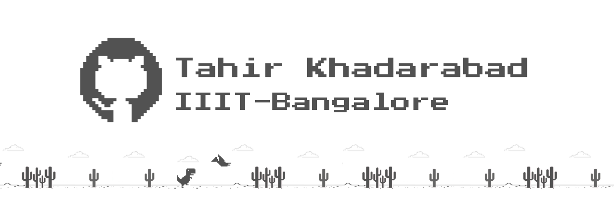

<!--
**Tah1rTheT1ger/Tah1rTheT1ger** is a ✨ _special_ ✨ repository because its `README.md` (this file) appears on your GitHub profile.

Here are some ideas to get you started:

- 🔭 I’m currently working on ...
- 🌱 I’m currently learning ...
- 👯 I’m looking to collaborate on ...
- 🤔 I’m looking for help with ...
- 💬 Ask me about ...
- 📫 How to reach me: ...
- 😄 Pronouns: ...
- ⚡ Fun fact: ...
-->

# 👋 Hey There!
Welcome to my tiny corner of GitHub! Let's dive into who I am and what I'm up to 🌍

👨‍💻 I'm a passionate skeptic of Artificial Intelligence, always exploring the boundaries of Data Visualization, Software Development, and all the weird and wonderful corners of Computer Science. I love thinking about how computers and social networks influence human psychology and political consciousness.

🎮 Gaming is my therapy, especially grinding ranked in Halo Infinite or getting hilariously one-tapped in Fortnite (weekly tradition). When I'm not gaming, you can catch me binging unnecessarily long game lore videos or lost in a good sci-fi novel.

👾 At college, I wear a lot of hats:

Mentoring a team at 8Bit, our student-run magazine club
Being a core member of the Debate Society and competing in MUNs
Organizing stargazing nights with the Astronomy Club. 🌌
📱 Currently, I'm working on designing and developing a few Android apps, diving into Machine Learning and OpenCV, and thinking about how generative AI can reshape our future (help is welcome here!).

💡 I’m always down to chat about the impact of technology on the world or collaborate on building cool software solutions for education.

Join me on this wild journey through tech, games, and the cosmos!

## 🌐 Socials:
    

# 💻 Tech Stack:
                         

# 📊 GitHub Stats:
 
 

### 🔝 Top Contributed Repo

---

<!-- Proudly created with GPRM ( https://gprm.itsvg.in ) -->
